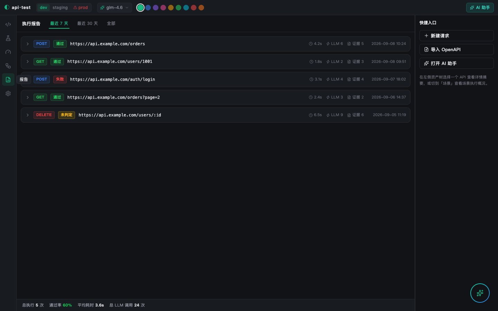

# VerifyOS

**Agentic UI testing & API testing platform with verifiable evidence — self-hosted, LLM-driven.**

[](LICENSE)


English | [简体中文](README.zh-CN.md)

VerifyOS turns LLM agents into QA engineers: they explore a running app, extract checkable QA points, execute verifications with full evidence chains (screenshots, video, network, console, trace), and gate pull requests with targeted regression. "Unverifiable" is a first-class outcome — never a false green.


<p align="center">
  
</p>

<p align="center"><sub>The <code>api-test</code> subsystem — API execution reports with LLM-call &amp; evidence counters.</sub></p>

## ✨ Features

- 🤖 **Agentic web-app exploration** — crawler + QA-point extraction + safe AI mutation, watched live in the exploration workbench (exploration path, Intent-Score ranking, live findings over WebSocket) — `packages/agent-core` + `apps/web`
- ✅ **Evidence-backed verification** — per-step screenshots, video replay, network/console/trace panels; every result traceable: Run → verification → QA point → requirement
- 🧠 **AI failure triage** — attribution with confidence, plus human classification on top
- 🔀 **PR verification gate** — webhook pipeline: preview env → impact analysis → targeted regression → merge gate with report write-back
- 📱 **Mobile testing** — native app runs on the same step/evidence model (launch steps, sub-actions, per-step screenshots)
- 🔌 **Any OpenAI-compatible LLM** — Zhipu GLM / DeepSeek / self-hosted gateways; the `api-test` subsystem degrades to a built-in mock provider without any key
- 🔐 **Secrets stay local** — stored credentials encrypted at rest (`CREDENTIAL_ENCRYPTION_KEY`), optional Langfuse tracing

## 🏗 Monorepo layout

| Path | What it is |
|---|---|
| `apps/server` | NestJS API + WebSocket gateway (drives agent-core) |
| `apps/web` | React 18 + Vite console |
| `packages/agent-core` | crawler / runner / evidence / impact / QA-extraction engine |
| `packages/shared` | shared types & event contracts |
| `packages/cli` | VerifyOS CLI + agent skills |
| `api-test` · `api-test-ui` | API testing subsystem (mock-first design) |
| `desktop` | desktop client |
| `promo` | Remotion promo-video project |
| `docs` | PRD, deploy guide, design assets, internal notes |

## 🚀 Quick Start

Requirements: **Node ≥ 20**, **pnpm** ( `corepack enable` ), PostgreSQL/Redis/MinIO via Docker (`pnpm infra`) — or let `start.sh` manage a local PostgreSQL for you.

```bash
git clone https://github.com/KrabWW/verifyos.git
cd verifyos

# ① configure your LLM — interactive: pick GLM / DeepSeek / custom, paste API key
bash scripts/setup-llm.sh

# ② run locally in one click: PostgreSQL(5433) + API(8080) + Web(5174)
bash start.sh
```

Production via Docker (console on `:8081`):

```bash
docker compose -f docker-compose.prod.yml up -d --build
```

### LLM configuration

All keys live in `.env` — git-ignored, never commit them. `scripts/setup-llm.sh` writes it for you; or copy [`.env.example`](.env.example) manually.

| Provider | Get a key | Default model |
|---|---|---|
| Zhipu GLM | [bigmodel.cn console](https://bigmodel.cn) | `glm-4.6` (vision: `glm-4.5v`) |
| DeepSeek | [platform.deepseek.com](https://platform.deepseek.com) | `deepseek-chat` |
| Custom | any OpenAI-compatible endpoint (vLLM / Ollama / OneAPI…) | your choice |

## 📚 Documentation

| Doc | Content |
|---|---|
| [docs/DEPLOY.md](docs/DEPLOY.md) | private deployment in ~30 min (Docker), ops, backup, security checklist |
| [docs/PRD.md](docs/PRD.md) | full product requirements — 6 scenarios, data model, event model |
| [docs/PLUGIN_GUIDE.md](docs/PLUGIN_GUIDE.md) | plugin development |
| [docs/design/prototype.html](docs/design/prototype.html) | interactive high-fidelity prototype — single file, open in any browser |
| [CONTRIBUTING.md](CONTRIBUTING.md) | dev setup & workflow |

Internal working notes (design audits, tickets, research) live under `docs/internal/`.

## 🤝 Contributing

PRs and issues are welcome — see [CONTRIBUTING.md](CONTRIBUTING.md).

## 📄 License

[MIT](LICENSE) © 2026 KrabWW
