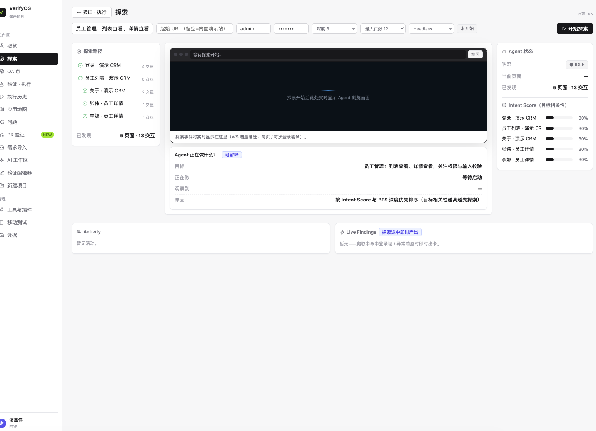

# VerifyOS · 中文 AI 测试平台

**LLM 智能体驱动的 UI 测试 + API 测试平台——探索应用、沉淀 QA 点、带完整证据链执行验证、为 PR 把关；支持私有化部署。**

[English](README.md) | 简体中文



## ✨ 特性

- 🤖 **智能体探索测试**——爬虫 + QA 点提取 + 安全 AI 变异（基于 Playwright，见 `packages/agent-core`）
- ✅ **证据链验证**——逐步截图、视频回放、Network / Console / Trace 面板；结果全链路可追溯：Run → 验证 → QA 点 → 需求
- 🧠 **AI 失败归因**——置信度 + 人工分类
- 🔀 **PR 验证门禁**——Webhook 流水线：Preview 环境 → 影响分析 → 定向回归 → 合并门禁 + 报告回写
- 📱 **移动测试**——原生 App 复用同一套步骤/证据模型
- 🔌 **任意 OpenAI 兼容 LLM**——智谱 GLM / DeepSeek / 自建网关；`api-test` 子系统无 Key 时自动降级内置 Mock
- 🔐 **密钥只在本地**——凭据静态加密（`CREDENTIAL_ENCRYPTION_KEY`），可选 Langfuse 可观测

## 🏗 仓库结构

| 路径 | 说明 |
|---|---|
| `apps/server` | NestJS API + WebSocket 网关（驱动 agent-core） |
| `apps/web` | React 18 + Vite 控制台 |
| `packages/agent-core` | 爬虫 / 执行器 / 证据 / 影响分析 / QA 点提取引擎 |
| `packages/shared` | 共享类型与事件契约 |
| `packages/cli` | VerifyOS CLI + agent skills |
| `api-test` · `api-test-ui` | API 测试子系统（Mock 优先设计） |
| `desktop` | 桌面客户端 |
| `promo` | Remotion 宣传片工程 |
| `docs` | PRD、部署指南、设计资产、内部笔记 |

## 🚀 快速开始

依赖：**Node ≥ 20**、**pnpm**（`corepack enable`）、PostgreSQL/Redis/MinIO（`pnpm infra` 用 Docker 起；或交给 `start.sh` 管理本地 PG）。

```bash
git clone https://github.com/KrabWW/verifyos.git
cd verifyos

# ① 配置 LLM：交互式选 智谱 GLM / DeepSeek / 自定义，粘贴 Key
bash scripts/setup-llm.sh

# ② 本地一键起服：PG(5433) + API(8080) + Web(5174)
bash start.sh
```

生产环境（Docker，控制台 `:8081`）：

```bash
docker compose -f docker-compose.prod.yml up -d --build
```

完整步骤 / 运维 / 备份 / 安全清单见 **[docs/DEPLOY.md](docs/DEPLOY.md)**。

## ⚙️ 配置 LLM（3 步）

仓库**不含任何真实密钥**：所有密钥只存在本地 `.env`（已被 `.gitignore` 忽略，不会提交）。

| 提供商 | Key 申请 | 默认模型 |
|---|---|---|
| 智谱 GLM | [bigmodel.cn](https://bigmodel.cn) 控制台 → API Keys | `glm-4.6`（视觉任务 `glm-4.5v`） |
| DeepSeek | [platform.deepseek.com](https://platform.deepseek.com) → API Keys | `deepseek-chat` |
| 自定义 | 任意 OpenAI 兼容端点（vLLM / Ollama / OneAPI…） | 自填 |

> 手动党：`cp .env.example .env` 后按文件内注释填写即可。`start.sh` 会自动读取 `.env` 中的 `LLM_API_KEY`。

## 📚 文档

- [docs/PRD.md](docs/PRD.md) —— 产品需求文档（六大场景 / 数据模型 / API 与 WebSocket 事件）
- [docs/DEPLOY.md](docs/DEPLOY.md) —— 私有化部署（30 分钟起服）+ 运维
- [docs/PLUGIN_GUIDE.md](docs/PLUGIN_GUIDE.md) —— 插件开发
- [docs/design/prototype.html](docs/design/prototype.html) —— 高保真可交互原型（单文件，浏览器直接打开：探索工作台 / QA 点 Drawer / 验证执行三态 / PR 验证报告 / 移动测试等核心屏）
- [docs/internal/](docs/internal/) —— 内部工作笔记（设计评审、工单、调研）
- [CONTRIBUTING.md](CONTRIBUTING.md) —— 参与开发

## 🎬 宣传片（Remotion）

```bash
cd promo
pnpm install
npx remotion studio                                # 预览
npx remotion render Promo out/verifyos-promo.mp4   # 渲染
```

配音：CosyVoice 中文语音（`promo/scripts/generate_tts.py`）。

## 📄 协议

[MIT](LICENSE) © 2026 KrabWW
